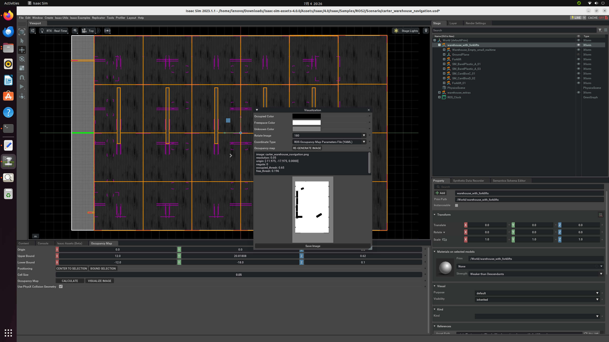

# Week 3 Report

## ROS 2 installation and setup

- Follow the documentation "ROS and ROS 2 Installation" to install ROS 2 in Ubuntu 22.04.
- Attempt to enable the ROS Bridge Extension: 
  - 1. Set the environment variable by typing: 
  ```shell
  export FASTRTPS_DEFAULT_PROFILES_FILE=~/humble_ws/fastdds.xml
  ```
  - 2. Source the ROS 2 environment in the terminal with the following command:
  ```shell
  source /opt/ros/humble/setup.bash
  ```

  - 3. Launch Isaac Sim and find ROS2 BRIDGE enxtension in the extension manager. However, failed to enable it.

  - Reason of failling：workspace has not been set up.

- Setting up workspaces:
  - 1. Clone the Isaac Sim ROS Workspace Repository from https://github.com/isaac-sim/IsaacSim-ros_workspaces under the "Home" folder: 
  ```shell
  git clone https://github.com/isaac-sim/IsaacSim-ros_workspaces
  ```
  - 2. Install additional packages:
  ```shell
  # For rosdep install command
  sudo apt install python3-rosdep python3-rosinstall python3-rosinstall-generator python3-wstool build-essential
  # For colcon build command
  sudo apt install python3-colcon-common-extensions
  ```
  - 3. Source the native ROS2:
  ```shell
  source /opt/ros/humble/setup.bash
  ```
  - 4. Resolve any package dependencies from the root of the ROS 2 workspace:
  ```shell
  cd humble_ws
  rosdep install -i --from-path src --rosdistro humble -y
  ```
  - 5. Build the workspace:
  ```shell
  colcon build
  ```
- Simplifying the process of running Isaac Sim with ROS2: 
  - Source the ROS2 environment and workspace in the `~/.bashrc` file. To use a ROS 2 bridge before launching Isaac Sim: set the environment variable in the `~/.bashrc` file and set it under “Extra Args” when launching Isaac Sim from the NVIDIA Omniverse™ Launcher. Then Isaac sim can be launched from Omniverse Launcher with ROS 2 enabled.
  - Chanllenge & Solution: if `./isaac-sim.sh --export FASTRTPS_DEFAULT_PROFILES_FILE=~/humble_ws/fastdds.xml` under "Extra Args" does not work, `./isaac-sim.sh --export FASTRTPS_DEFAULT_PROFILES_FILE="~/humble_ws/fastdds.xml"` should work. 
  - It is later found that the method shown above can make situation complex and may cause problem when dealing with different environments. So instead of adding those commands into the `~/.bashrc` file, it is better to create a new shell file and add those commands and launch `isaac-sim.sh` in it.

- After these steps, the ROS2 BRIDGE extension can be enabled.

## Go throught some parts of the ROS 2 Tutorials

### Tutorial: URDF Import: Turtlebot

- Importing TurtleBot URDF: 

  - Download and build the Turtlebot3’s description package inside the provided ROS2 workspace using: 
  ```bash
  git clone -b <distro>-devel https://github.com/ROBOTIS-GIT/turtlebot3.git turtlebot3
  ```
    
    - Challenge: 
    1. `<distro>` should identified as a placeholder and should be replaced with `humble` in this case.
    2. 
    - After entering the command, an error occurs:
    ```bash
    error: RPC failed; curl 92 HTTP/2 stream 0 was not closed cleanly: CANCEL(err 8)
    error: 4026 bytes of body are still expected
    fetch-pack: unexpected disconnect while reading sideband packet
    fatal: early EOF
    fatal: fectch-pack: invalid index-pack output
    ```
    - Solution: This error may be due to network connection problems and can be solved by cloning with lower bandwidth with the following commands:
    ```bash
    cd ~/IsaacSim-ros_workspaces/humble_ws/src
    git clone --depth 1 -b humble-devel https://github.com/ROBOTIS-GIT/turtlebot3.git
    ```
  
  - Import turtlebot and tune the robot:
  
  <a  target="_blank"></a>
  <!-- [](https://docs.omniverse.nvidia.com/isaacsim/latest/ros2_tutorials/tutorial_ros2_turtlebot.html#isaac-sim-app-tutorial-ros2-turtlebot) -->


### Tutorials: Add Simple Objects & Assemble a Simple Robot
#### -- extending "URDF Import: Turtlebot"
  - Pictures to be uploaded.

### Tutorial: ROS2 Navigation:
  - Install Nav2 using the following commands:
  ```bash
  sudo apt install ros-humble-navigation2
  sudo apt install ros-humble-nav2-bringup
  sudo apt install ros-humble-turtlebot3-gazebo
  ```
  - Creat a shell file for setting key environment variables and add the following commands:
  ```bash
  source /opt/ros/<ros2-distro>/setup.bash
  export TURTLEBOT3_MODEL=waffle
  export GAZEBO_MODEL_PATH=$GAZEBO_MODEL_PATH:/opt/ros/humble/share/turtlebot3_gazebo/models
  ```
  - Launch Isaac Sim and enable the `omni.isaac.ros2_bridge` Extension.
  - Generate an occupancy map of the warehouse environment using the Occupancy Map Generator extension.

  [](https://docs.omniverse.nvidia.com/isaacsim/latest/ros2_tutorials/tutorial_ros2_navigation.html)


  - Run Nav2

  


