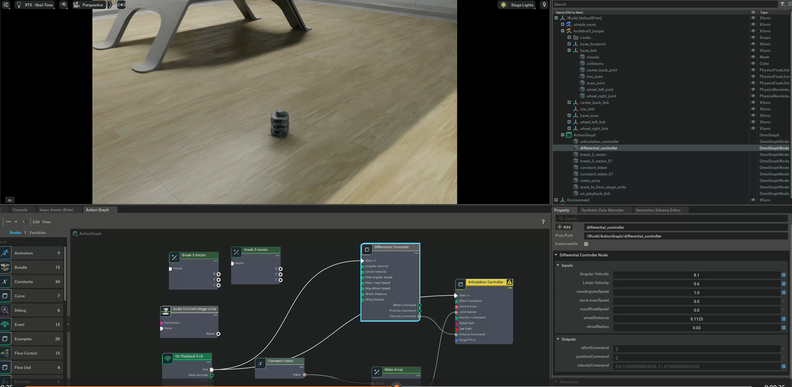

# Week 4 Report
## Omnigraphs
- Undersand the Omnigraphs and the utilities of different nodes in an omnigraph.
- Produce an example of an omnigraph.
  
## Control robots by action graphs
- Make an simple action graph and use it to control robots in Isaac Sim directly.
   
- Make a complete action graph and control the robot by either command in the terminal or by using keys on the keyboard.
- Click the image below to see a video of controlling a robot.
  
