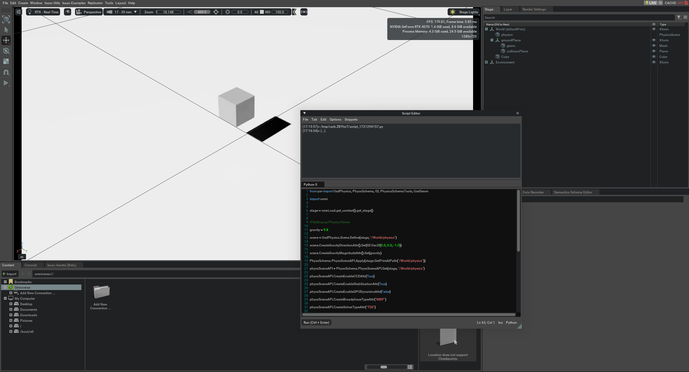

# Week 5 Report
## Interactive Scripting
- Learn to use script editor, REPL extension and Isaac Sim Core APIs.
### Use USD APIs in script editor to interact with the stage.
  

### Learn to use REPL extension
  
  
### Use Isaac Sim Core APIs
  

## Cameras and Sensors
### Add Cameras & Sensors
- Attach cameras and sensors to a robot to track the robot's position from different perpectives.
  [Click](videos/attach_cameras.webm) to see a video of tracking robot's position from differnt cameras.
### Building the Graph for a camera publisher
  
  

### Check Images published in RViz2
  
