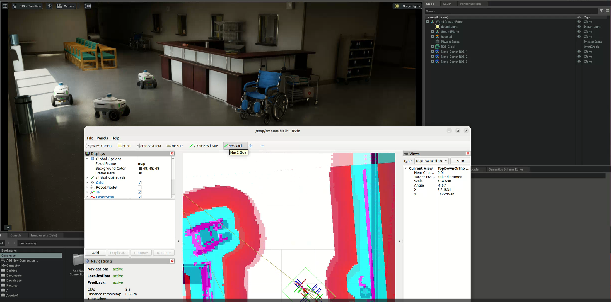

# Week 6 Report
## Robot Navigation

### Single Robot Navigation
-- 1. Load the warehouse scenario in Isaac Sim.

-- 2. In a new terminal, source the ROS2 installation and workspace, and run the ROS2 launch file .
  ```shell
  ros2 launch carter_navigation  carter_navigation.launch.py
  ```
-- 3. Click on the **Navigation2 Goal** button and then click and drag at a desired location to set the goal.

 **Click the image below to see a video.**
  <a href="videos/single_robot_navigation.webm" target="_blank"></a>

### Multi-robot Navigation
-- Similar to **Single Robot Navigation**, but load the hospital scenario this time and run:
  ```shell
  ros2 launch carter_navigation multiple_robot_carter_navigation_hospital.launch.py
  ```

 **Click the image below to see a video.**
   <a href="videos/multi-robot_navigation.webm" target="_blank"></a>