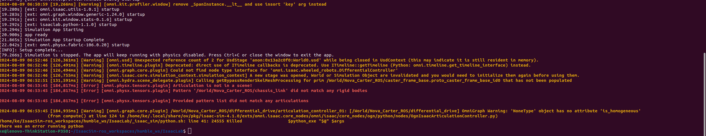

# Week 8 Report
## Installing Isaac Lab
Follow the [Isaac Lab documentaion](https://isaac-sim.github.io/IsaacLab/source/setup/installation/binaries_installation.html) to install Isaac Lab and verify the installation.

-- 1. Clone the Isaac Lab repository into the workspace humble_ws
-- 2. Create the Isaac Sim Symbolic Link
-- 3. Set up the conda environment
-- 4. Install dependencies and run the install command
-- 5. Verify the Isaac Lab installation

## Trying to play the simulation after loading USD navigation samples

Ran the following to launch Isaac Lab:
```bash
source /opt/ros/humble/setup.bash

source ~/IsaacSim-ros_workspaces/humble_ws/install/local_setup.bash

export FASTRTPS_DEFAULT_PROFILES_FILE=/home/ke/IsaacSim-ros_workspaces/humble_ws/fastdds.xml

./isaaclab.sh -p source/standalone/tutorials/00_sim/create_empty.py
```

After opening `carter_warehouse_navigation.usd` in Isaac Lab, I tried to play the simulation. However, it didn't work and there were error messages in the terminal, which is shown in the image below. Details can be found in [here](https://forums.developer.nvidia.com/t/failed-to-play-the-navigation-example-and-enable-ros2-extension-in-the-isaaclab-virtual-environment/302829).

  <a href="" target="_blank"></a>

I've also tried other navigation USD samples, but they don't work either. Sometimes there are no errors in the terminal, but the Isaac Sim window keeps not responding. 